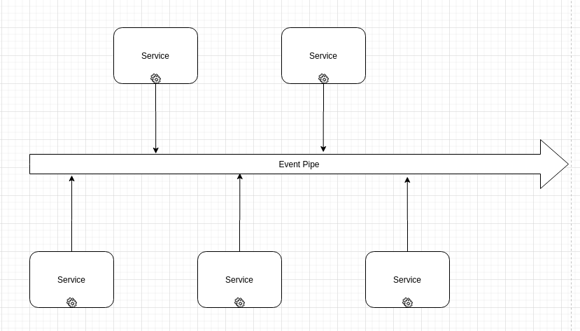

# Event Pipe 🕦️

This document describes Event pipe and Events themselves.

Event Pipe in systems generally looks like this:
;

Services are listening or emitting events to a single EventEmmiter instance.

Events are defined in different namespaces separated with double colon sign `namespace::sub-namespace::event-name`

List of events could be found [here](./Events.md)

## Usage

If you want to fire an event not registered at docs, do not forget to document your event.

If you want to listen to one of the defined events, then follow:

```js
import pipe from "@/pipe"; // pipe object
import events from "@/pipe/names"; // event constants

pipe.on(events.some.event, () => {
  /* handler code */
});
```
