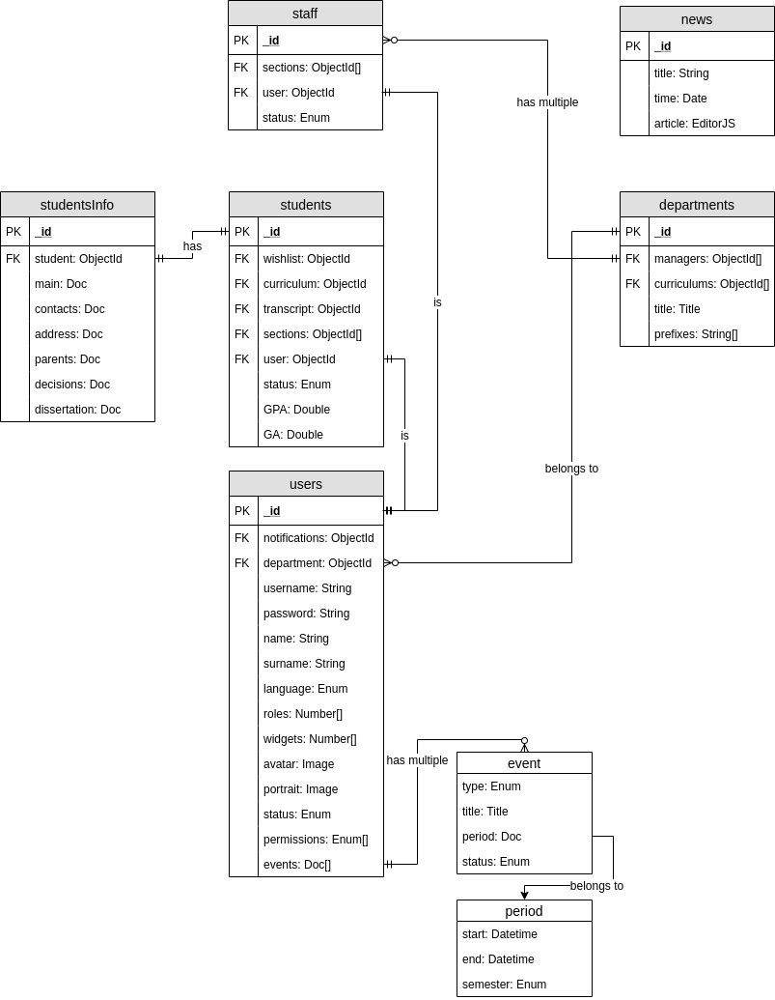

# Database reference 🗄️

This document describes MongoDB database structure.

**Defined schemas description:** [Link](./01_Schemas.md)
**Project on .drawio file:** [Link](./project.drawio)

**Note:** currently defined schema is based on [brainstormed one](#brainstormed-schema)

## Currently implemented

## Brainstormed Schema

